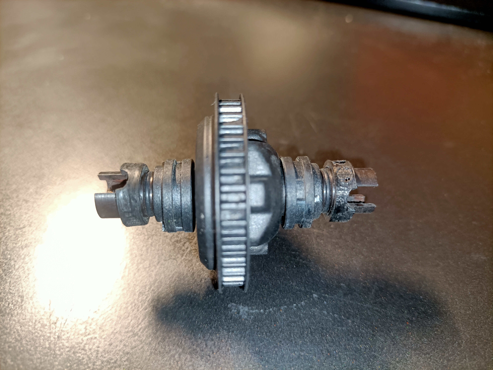
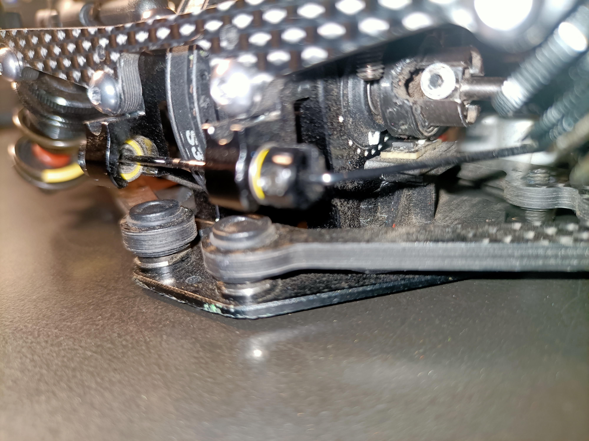

# Schumacher Mi9 Brackets

This folder contains all brackets for the **Schumacher Mi9 touring car** and instructions for installation.

---

## 📑 Table of Contents
- [🧲 Magnet Ring](#-magnet-ring)
  - [Before You Start](#before-you-start)
  - [Installing the Magnet Ring](#installing-the-magnet-ring)
  - [Installing the Magnets](#installing-the-magnets)
- [⚙️ Wheel Speed Sensor Bracket](#️-wheel-speed-sensor-bracket)
- [💡 Tips & Notes](#-tips--notes)

---

## 🧲 Magnet Ring

The magnet ring has slots for **4 magnets**. The designed magnet size is **3×1 mm**.

### Before You Start
> ⚠️ **Important:** The ring is designed for **new or clean outdrives**. If you are using old outdrives, remove any extra material from the top surface before installation.

### Installing the Magnet Ring
1. Insert the **outer side** of the crescent-shaped pin into the driveshaft bearing slot on the diff outdrive.  
2. The ring should fit snugly.  
   💡 *You can secure it with a **tiny** drop of CA glue if needed.*

---

### Installing the Magnets

1. Use **long-nose pliers** or any pliers with a thin, flat tip.  
2. Apply a small piece of **packing tape** to the plier tips to avoid scratching the magnets.  
3. Open the magnet package without removing them from the sticker backing.  
   💡 *Tip: Place the sticker on a **metal surface** so magnets stay in place.*  
4. Pick up the first magnet using the pliers.  
5. Place the magnet into one of the slots on the magnet ring.  
   ⚠️ *Only use **non-through holes** — through holes are for balancing only.*  
6. Gently press the magnet into place with the pliers.  
7. Slide the pliers away from the magnet.  
8. Repeat for the remaining three magnets.  

---

## ⚙️ Wheel Speed Sensor Bracket

1. Select the bracket matching your **transmission housing** (kit or high trans housing).  
2. Remove the **differential**, unscrew the trans housing from the chassis plate, and insert the bracket pin into the corresponding hole.  

   

3. Place the trans housing over the bracket, ensuring the pin stays in place.  
4. Attach the sensor to the bracket using **double-sided tape**.  
   📏 *The sensor’s black square must face the magnet ring on the diff outdrive.*  

   

5. Once fully assembled, it should look like this:  

     

---

## 💡 Tips & Notes

- 🕒 Take your time when installing magnets — a small misalignment can affect sensor readings.  
- 💧 If using CA glue, apply **only a minimal amount** to avoid damaging the ring.