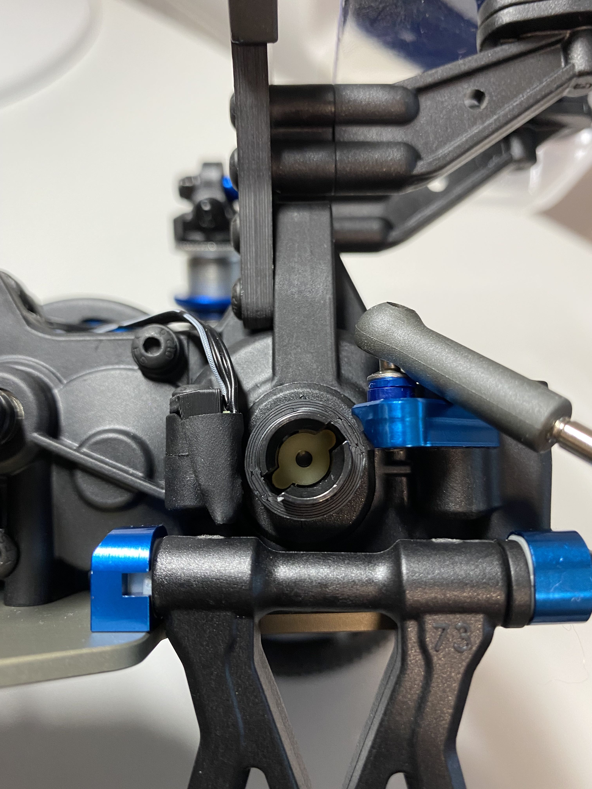
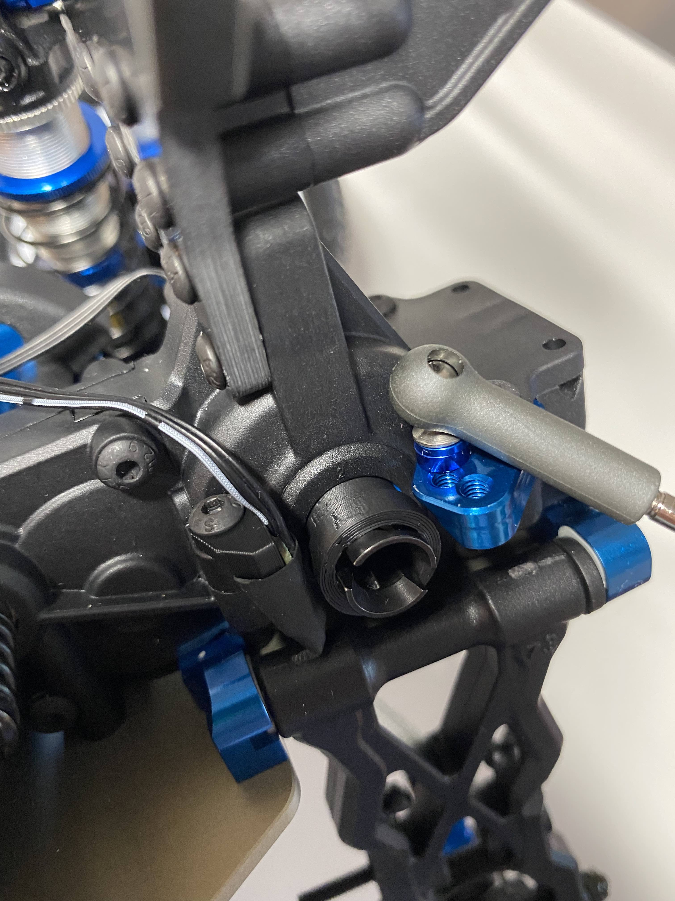

# Team Associated B6 series brackets
This folder has all brackets for AE RC10B6 series two wheel drive car. This file has some instructions how to install the

 

## Magnet ring
Magnet ring has slot for four magnets. Designed magnet size is 3x1mm.

How install magnets?
1. Get long nose pliers or any pliers with fairly thin flat surface on the tip
2. Put piece of packing tape on the flat surface of the tip
3. Open the magnets in the sticker package. Keep magnets on top of the sticker and place sticker on table. Tip: Place the sticker on metal surface so magnets on top of the sticker will stay in place.
4. Take first magnet from the top with a tip of the pliers.
5. Put one drop of CA glue on flat edge of the magnet
6. Place magnet to one of the slots in magnet ring
7. Compress magnet to the slot gently with the pliers
8. Slide pliers off from the magnet
9. Repeat for other three magnets.

## Wheel speed sensor bracket
* Fix sensor to the bracket with 6mm shrink tube which comes with the wheel speed sensor
* You can adjust the sensor height by using spacers below the bracket. This would be necessary if you adjust the diff height.
